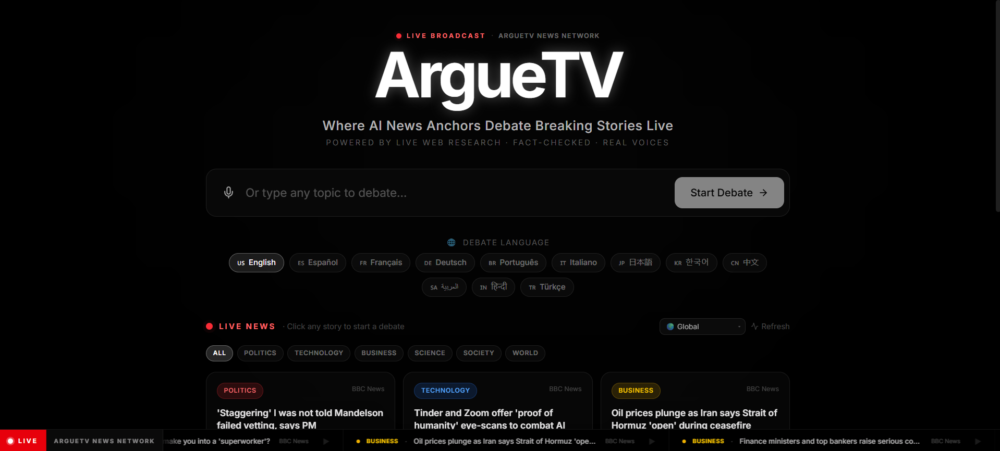

<div align="center">
  
# 📺 ArgueTV

**An AI-Powered Live Debate & Entertainment Platform**

[](https://vitejs.dev/)
[](https://reactjs.org/)
[](https://www.typescriptlang.org/)
[](https://openai.com/)
[](https://tailwindcss.com/)
[](https://vercel.com/)

</div>

---



## 📌 Overview

**ArgueTV** brings cutting-edge artificial intelligence into the realm of live debate and interactive entertainment. By leveraging advanced LLM technologies, ArgueTV creates dynamic, real-time debates between autonomous AI personas on user-selected topics. It combines seamless streaming, an interactive audience dashboard, and dynamic sentiment analysis to rethink how we engage with digital discussions.

## ✨ Features

- 🎭 **Autonomous AI Debates**: Watch customized AI personas tackle complex topics with unique stances in real-time.
- ⚡ **Interactive Spectator Dashboard**: View live transcriptions, speaker sentiment, and debate metrics.
- 🎨 **Premium Modern Interface**: Designed with glassmorphism aesthetics, deep dark modes, and dynamic framer-motion animations.
- 🛠️ **Modular Architecture**: Built completely with a `pnpm` workspace monorepo separating React apps from API and database services.
- ✅ **Agentic Testing**: Native integration with TestSprite for continuous AI-driven testing.

## 🧰 Tech Stack

- **Frontend**: React 19, Vite, Tailwind CSS, Framer Motion
- **Backend / API**: Node.js, TypeScript, Express, Zod
- **Integrations**: OpenRouter / OpenAI, Firecrawl, ElevenLabs
- **Deployment**: Vercel (Serverless Functions + Static Frontend)
- **Tooling**: `pnpm` Workspaces, Corepack, TestSprite MCP

## 📂 Project Structure

```text
ArgueTV/
├── api/                        # Vercel Serverless Function entry point
│   └── [...route].ts           # Catches all /api/* requests → Express app
├── src/
│   ├── apps/
│   │   ├── web/                # React frontend (Vite + Tailwind)
│   │   └── api/                # Express backend API server
│   └── packages/
│       ├── api-client-react/   # Auto-generated React Query API hooks
│       ├── api-spec/           # OpenAPI spec definitions
│       ├── api-zod/            # Zod validation schemas
│       ├── db/                 # Database schema & connections
│       └── integrations/
│           ├── openai-react/   # Frontend AI chat components
│           └── openai-server/  # Backend AI logic (OpenRouter/OpenAI)
├── testsprite_tests/           # AI-generated test cases (TestSprite)
├── vercel.json                 # Vercel deployment configuration
├── pnpm-workspace.yaml         # Monorepo workspace definitions
├── README.md                   # Project documentation
├── screenshot.png              # UI screenshot for README
└── demo.mp4                    # Demo video of the platform
```

## 🚀 Getting Started

### Prerequisites
- [Node.js](https://nodejs.org/) (v18+)
- [pnpm](https://pnpm.io/) (via Corepack)
- An [OpenRouter](https://openrouter.ai/) API Key (or OpenAI-compatible key)

### Installation

1. Clone the repository:
   ```bash
   git clone https://github.com/yourusername/arguetv.git
   cd arguetv
   ```

2. Configure environment variables:
   ```bash
   cp .env.example .env
   # Edit .env and fill in your API keys
   ```

3. Install dependencies:
   ```bash
   corepack pnpm install
   ```

### Running Locally

Start the API and Web servers independently:

```bash
# Terminal 1 — API Server (Port 8080)
pnpm run dev:api

# Terminal 2 — Web Dashboard (Port 22772)
pnpm run dev:web
```

Then open **http://localhost:22772** in your browser.

## 🌐 Deploying to Vercel

This project is pre-configured for **zero-config Vercel deployment**.

### 1. Push to GitHub
```bash
git init
git add .
git commit -m "Initial commit"
git remote add origin https://github.com/yourusername/arguetv.git
git push -u origin main
```

### 2. Import in Vercel
1. Go to [vercel.com/new](https://vercel.com/new)
2. Import your GitHub repository
3. Vercel will auto-detect `vercel.json` — no manual config needed

### 3. Set Environment Variables
In your Vercel project dashboard → **Settings → Environment Variables**, add:

| Variable | Required | Description |
|---|---|---|
| `AI_INTEGRATIONS_OPENAI_BASE_URL` | ✅ | `https://openrouter.ai/api/v1` |
| `AI_INTEGRATIONS_OPENAI_API_KEY` | ✅ | Your OpenRouter API key |
| `OPENROUTER_API_KEY` | ✅ | Same as above |
| `OPENROUTER_BASE_URL` | ✅ | `https://openrouter.ai/api/v1` |
| `FIRECRAWL_API_KEY` | ✅ | Enables live web research & fact-checking |
| `ELEVENLABS_API_KEY` | ✅ | Enables AI voice synthesis & audio playback |

### 4. Deploy
Click **Deploy** — Vercel handles the rest automatically!

## 🧪 Testing with TestSprite

We use an AI-agent approach for testing, ensuring maximum code quality:
1. Configure the TestSprite MCP server in your IDE
2. Ask your AI assistant: *"Help me test this project with TestSprite"*
3. Tests are generated and stored in `testsprite_tests/`

---
<div align="center">
  <i>Built to rethink digital debates using modern Web AI.</i>
</div>
